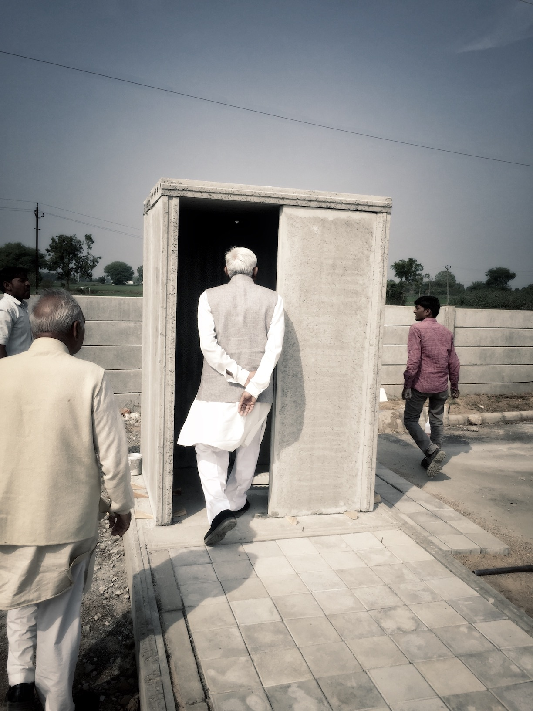

# Akash Patel

#### [PDF Resume](./downloads/akash_patel_4_2017.pdf)
#### Contact
✉️: akashpatel.sit@gmail.com
📞: +1-201-673-6395

## Education
#### Stevens Institute of Technology, Hoboken, NJ
  - Master of Engineering in Civil Engineering
  - Course Work: Advanced Reinforced Concrete Structures, Advanced Steel Structures,
Introduction to Finite Element Methods, Geotechnical Design, Soil Behavior and its
Environmental Applications, Advanced Structural Analysis.
- Expected Graduation December 2017

#### Dharamsinh Desai University, Nadiad, Gujarat, India
  - Bachelor of Technology in Civil Engineering
  - Graduation: June 2014

## Experience

### Teaching Assistant @ Stevens Institute of Technology
I am an active teating assitant for Introduction to Finite Element Method couse. This involves designing and evaluating assignments, projects, exams, and holding office hours for
Introduction to Finite Element Method.

### Lead Engineer @ [BN Precast Pvt Ltd.](http://www.bnprecast.com/)
  - Ahmedabad India, June 2014 - December 2015
  - Prepared Contract drawings, specifications and worked as on-site WallTec expert for
  Sumitomo Mitsui Construction Company for their project Honda Two Wheeler
  Manufacturing Plant in Gujarat, India.
  - Developed drawings, specification and other documents for retrofitting an existing
  building (Shalby Hospitals) by installing WallTec walls in less than 4 months,
  including development of custom carting solutions based on site condition.
  - Designed and developed a process to manufacture Light Weight Aggregate (LWA)
  using Autoclaved Aerated Concrete(AAC) waste. Which lead to 34% weight
  reduction in WallTec panels.
  - Documented and built prototype low cost sanitation unit for rural villages in India as
  per [Clean India Mission](http://www.pmindia.gov.in/en/government_tr_rec/swachh-bharat-abhiyan-2/) guidelines.
  - Established a quality control laboratory for raw materials and finished product.
  - Identified and implemented work practices that improved safety and operational cost.
  - Following up with local government authorities for approval of WallTec as building
  material in government projects.

### Engineering associate @ Savvy Infrastructures Pvt Ltd.
  - Ahmedabad, India, December 2013 - March 2014
  - Coordinated designed discussion between architects and onsite team throughout project development.
  - Verifying materials procurement as well as managing vendors and sub-contractors during various phases of construction.
  - Planning and overseeing material tests as well as reviewing reports.
  - Measured and valued of construction progress as part of project surveying team.

## Skills
  - AutoCAD 2014/2016
  - Abaqus
  - Fundamentals of Staad Pro
  - Google SketchUp
  - Microsoft Office

## Other Interests
  * Volleyball
  * Swimming
  * Watching wood working videos on Youtube
