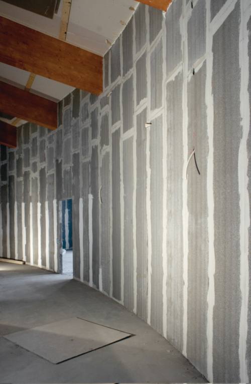
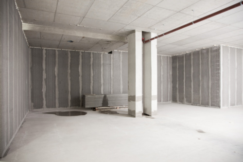
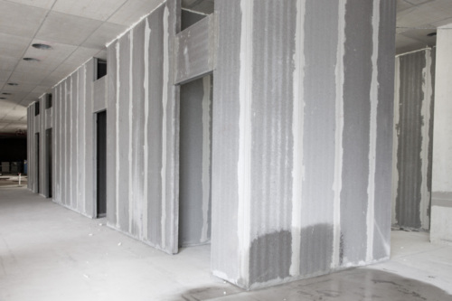
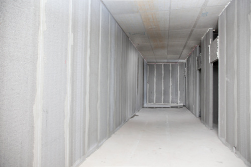

# WallTec installation @ Shalby Hospital – Surat

[Shalby Hospitals](http://shalby.org/Shalby_Hospital/Surat) is an Indian organization which was established in Ahmedabad as a joint replacement center in 1994 by Dr. Vikram Shah. Shalby runs a chain of hospitals in Vapi, Jabalpur, Indore, Jaipur, Punjab and now in Surat.

## Tasks
I was with this projects from start, I represented BN Precast as an Engineer while we were presenting our “Plan of Work”. And to convince clients team to proceed with precast walls was very challenging but our selling point was timeline because our estimated time of project delivery was nearly six months earlier than traditional brick masonry. And thus, we got the contract of installing 9000 Sq. meters (97000 Sq. foot) of precast walls for internal walls of the project.

Meanwhile, I was working on how to reduce the weight of our precast walls. And client liked it very much as they were going to save a lot by using light precast panels. By my study, I found that Expanded Clay (LECA) is used as aggregate for weight reduction in the precast industry but it was very costly. So, I had to find an alternative of Expanded Clay (LECA) and that alternative was to crush the waste of Autoclaved Aerated Concrete Block and it was easily available. This lead to a new challenge, there was no one producing light weight aggregate by crushing Autoclaved Aerated Concrete Block so we ended up designing a fully automated impact crusher from scratch. And as result of this hard work, we reduced weight by 37 % of our precast walls.

Now by the time RCC frame structure was ready for us, we had all sections manufactured and ready for transportation. From the beginning, we were aware that site conditions are very tight so we designed a precast wall delivery crane (video) and it reduced cost, wastage and cycle time drastically.

## What did I learn?

In this project the most important thing I learned was economics. After all considerations, the decision-making factor almost always comes to the “costs”. And managerial tasks like getting a contract and solving client’s concerns are equally challenging, important and time-consuming as engineering tasks.

This project really used and tested my problem-solving skills. By working on this project, I found myself more confident and calm in pressure.

## Pictures of the installation project

Here we were tasked to install 5 meters (16feet) high with a curve. We staggered the joints of two adjacent precast walls to get better structural stability. This was installed by crew size of 5 in 3 days.  

